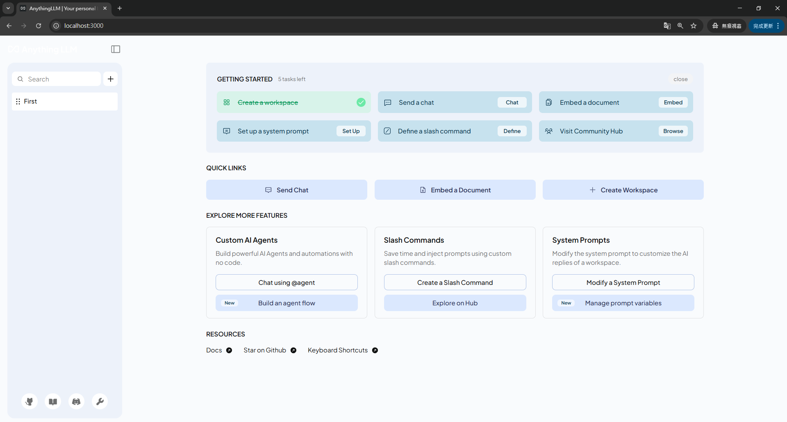
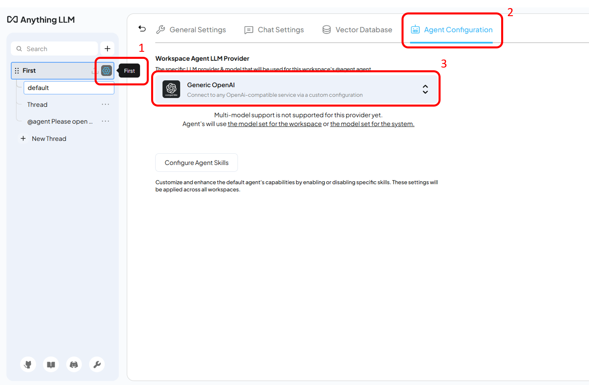
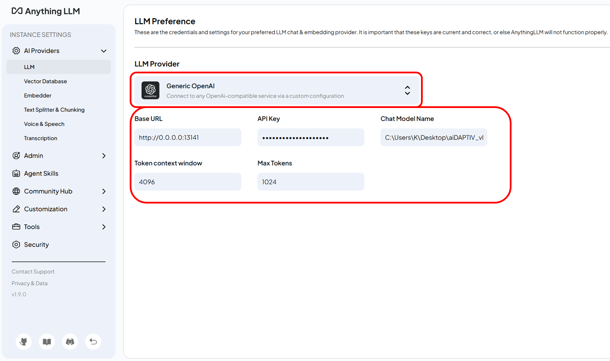
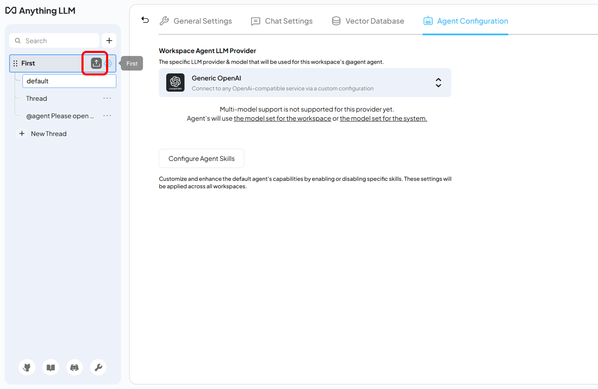
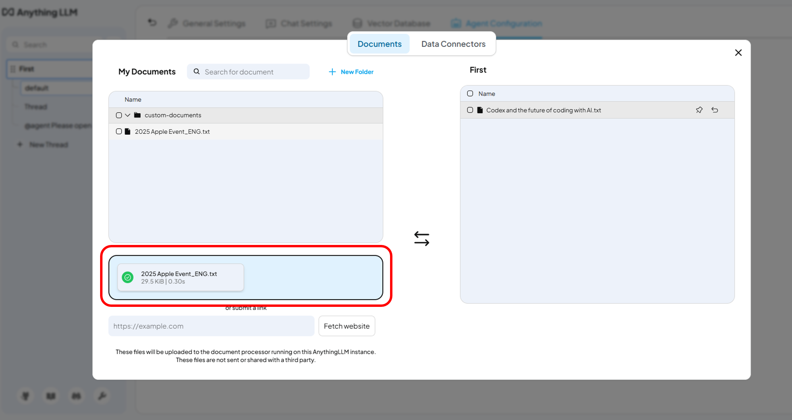
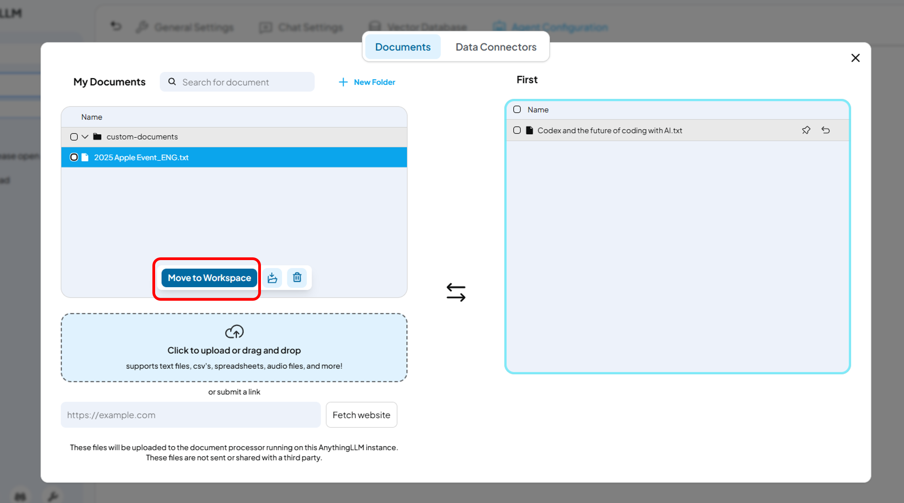
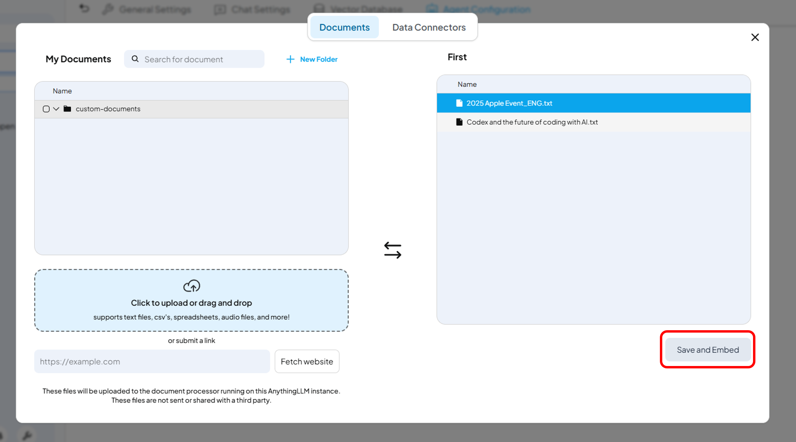
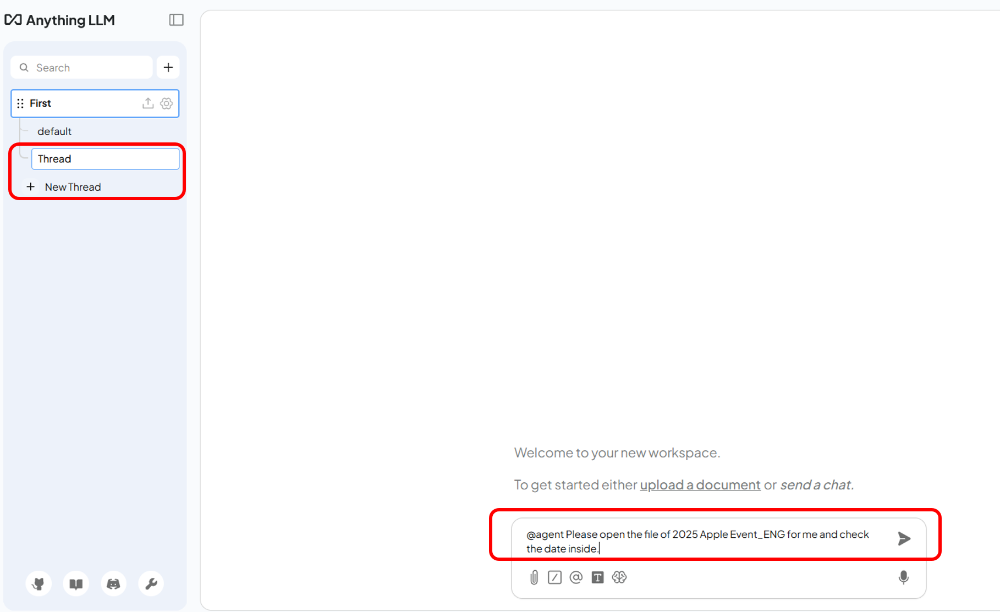
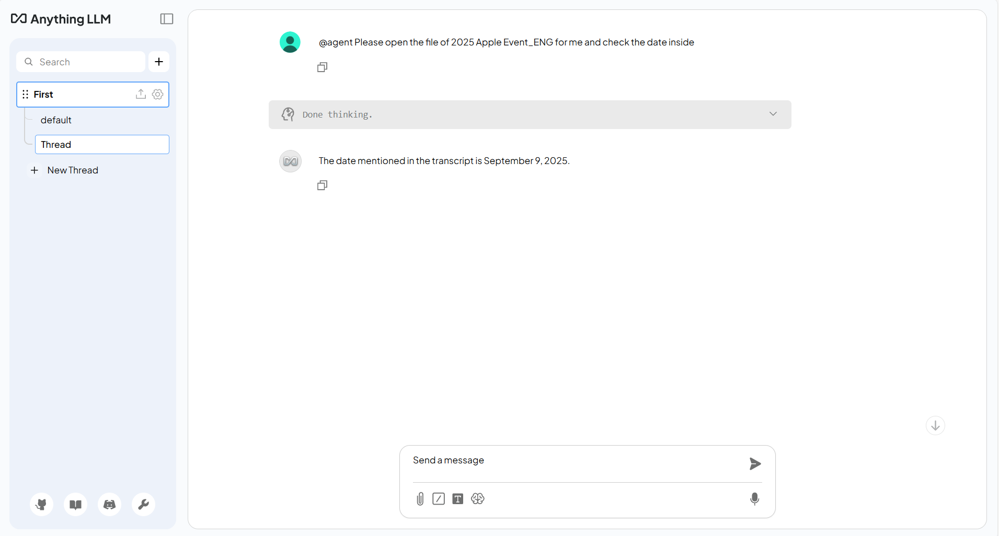

# AnyThingLLM User Guide

## Overview
This application allows users to ask questions from the text user provided. This functionality achieves quick responses from the LLM, enhancing the overall user experience.

---
## 1: Installation and Setting

### Step 1: Download the Repository

Download from [here](https://github.com/aiDAPTIV-Phison/aiDAPTIV-Integration-anything-llm/archive/refs/tags/aiDAPTIV_v0.0.1.zip)

### Step 2: Run the Auto Installer

1. **Initial Setup**
- Click on `./aiDAPTIV_Files/Installer/run-dev-all.bat` to launch the chat interface.(If occurs error, maybe try once again) The chat room can be found at http://localhost:3000 (default). 

_Note: You may need to run PowerShell as Administrator if Node.js needs to be installed._

This script will:
1. Install Node.js
2. Install npm
3. Install yarn
4. Install Prisma
5. Install project dependencies
6. Start the AnythingLLM server automatically.

---

## 2. Running the Application

Once the installation is complete, you can start the application.
The application can be found at http://localhost:3000 (default)

1. **Set LLM Endpoint**
- Fill in the **LLM Endpoint** and **Model Name** as required.

For example: 
    - Base URL: http://0.0.0.0:13141 (The endpoint you've created)
    - API Key: EMPTY (The API Key to the endpoint)
    - ChatModelName: C:\Users\K\Desktop\Llama-3.2-3B-Instruct-Q4_K_M.gguf (Path to model)
    - Token context window: 4096
    - Max Tokens: 1024

2. **Set RAG**
- Upload the txt as a reference to the question.

3. **Ask questions**
- Put "@agent" in the questions to enable the functionality of the RAG system. You can start asking questions about the txt you uploaded.

